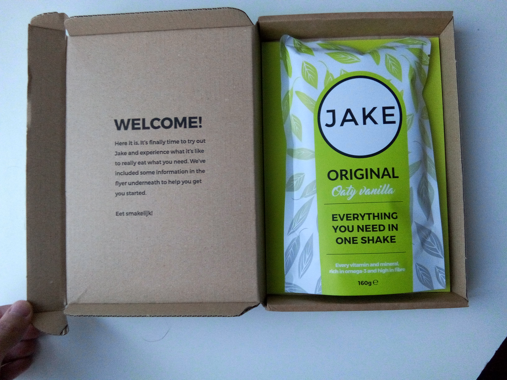
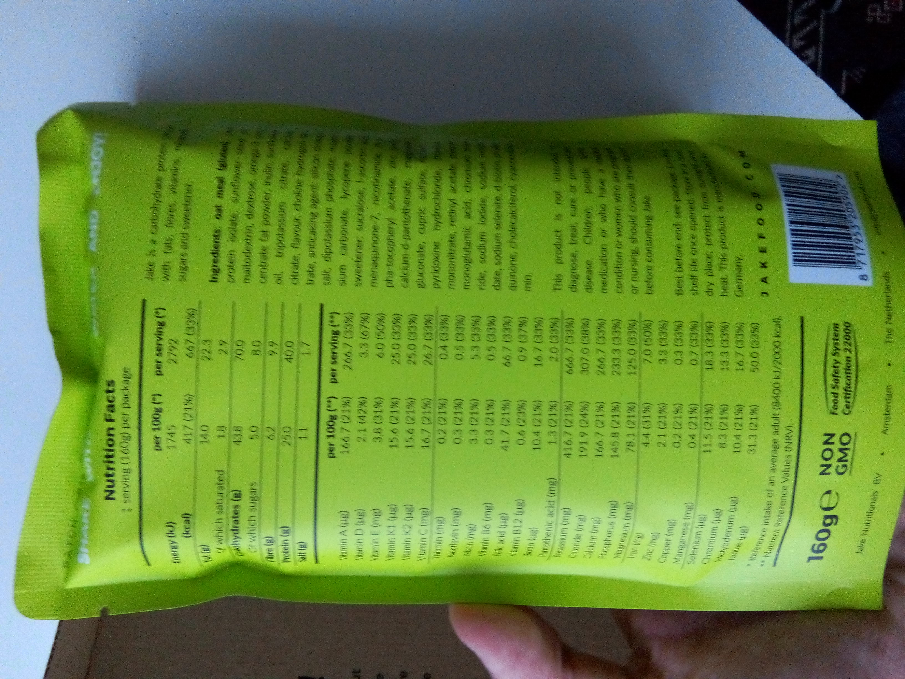

[Jake](https://jakefood.com) is a Soylent-like manufactured in the Netherlands (like many of them it seems!).
It's the first one I bought because unlike most of their competitors you can order only one meal, which is perfect to try it out.

## Shipping

It took about a month to arrive. At some point, after waiting a few weeks, I was so eager to try a Soylent-like that I ordered some [from a competitor](https://getkey.eu/blog/5839f763/queal), and it actually arrived before.

## The price

You can have the sample meal for 5€.
When you buy in bulk it's about 3€. The more you buy the cheaper it gets so [see for yourself](https://jakefood.com/product/jake-original/).

It's bit more expensive than the other 3 brands I tried, but still reasonable.

## The meal

It's vegan and lactose-free, which doesn't appeal particularly to me but it may to you.

The taste is... terrible. It is awfully sweet, so much that it makes it a bit nauseating.
It's kind of like porridge, but with whole a bag of sugar poured into it.

The texture on the other hand is fine.

I had it at lunch and I wasn't hungry until dinner so it seems nutritious.
But keep in mind I only had one meal of it, that I only finished for science. Unfortunately my love for science isn't strong enough for me to try it for a longer period of time.

## The packaging

The packaging is pretty good. It's sent in a fancy box.
The bag itself has all the relevant informations in the back, as you can see in the pictures.

Also, one bag is one meal. So there is no trouble figuring out proportions, which can be tedious at first. And it's a bit less work too.

