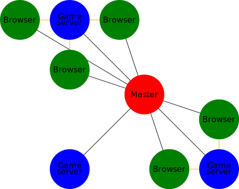

At some point in [JumpSuit](https://github.com/KordonBleu/jumpsuit)'s development I realized it was impossible to create the game we envisioned: WebSockets are just too slow, because they sit on top of TCP.

While it is possible to write moderately fast-paced games with them, such as the enormously successful [Agar.io](https://agar.io) and [Slither.io](http://slither.io/), if you need low-latency, WebSockets won't cut it.

So I started looking for alternatives.

WebRTC is currently the only way a browser can exchange with the outside world in UDP-like fashion -- disregarding Flash. While it is fairly recent, [browser support](http://iswebrtcreadyyet.com/) is decent enough that Facebook Messenger, Skype and Google Hangouts started using it, to only name a few.

However, WebRTC has been designed to do P2P VoIP on the browser, not to create game servers. But surprisingly, games benefit greatly from these same features which are essential to VoIP.

## Data channels are awesome

Along with audio and video, WebRTC makes it possible to create `DataChannel`s that allow sending arbitrary data.

While audio and video is transmitted through [RTP](https://en.wikipedia.org/wiki/Real-time_Transport_Protocol), data channels use [SCTP](https://en.wikipedia.org/wiki/Stream_Control_Transmission_Protocol).
SCTP is great because it's configurable: you can choose whether you want datagrams to be ordered and/or reliable.

Fast paced games use UDP because it's fast, at the expense of orderedness and reliability.
But some datagrams still need to be sent reliably, for example chat messages. Dropping chat messages is definitely *not okay*! So when using UDP, we end up having to implement reliability on top of it (why we can't use both TCP and UDP at the same time is outside the scope of this article, but you can [read the explanation here](http://gafferongames.com/networking-for-game-programmers/udp-vs-tcp/)).

Because SCTP is configurable, we can open multiple data channels with different settings, which saves us tons of work!

Typically we have:

* an unreliable and unordered data channel for game state data and user inputs
* a reliable and ordered data channel for chat messages, scores and deaths

## Network architecture

Okay so let's say we want a [client-server](http://gabrielgambetta.com/fpm1.html#authoritative-servers-and-dumb-clients) architecture, like most modern games.
WebRTC connects peers together. Since it is a protocol for the web, peers are generally browsers -- but nothing says your game server can't be a peer!
There are various libraries that make it possible to use WebRTC on the server. Most of them are wrappers over [Chromium's code](https://webrtc.org/native-code/).

We also want multiple game servers: if the game we are writing is successful, we can expect the load to be too high for a single server. Additionally, we may want to make it possible for random users to host game servers (that's what we did with JumpSuit). This is advantageous because you won't have to pay for hosting, and if it is possible for users to make mods, that will increase the longevity of the game. The downside is that you don't control hundredpercently the gameplay of your game.

Generally this is done by having a master server that knows the address of all game servers. To achieve this with a minimal amount of configuration, we can have games server register directly to it.
Then, clients will connect to the master server to request game server addresses.

WebRTC peers initially don't know each other, so they need some way to be introduced. Connection is achieved by exchanging metadata such as addresses, supported codecs (remember, this is a VoIP protocol), etc., in the [SDP format](https://en.wikipedia.org/wiki/Session_Description_Protocol).
WebRTC doesn't specify how these information are exchanged. It is possible to let the user [copy-paste it](https://github.com/ldecicco/webrtc-demos) for example. But I'm sure you'll agree that's impractical. So we will create a server that will relay this information through WebSockets. This is called a signaling server. It's kind of equivalent to a [BitTorrent tracker](https://en.wikipedia.org/wiki/BitTorrent_tracker).

Our signaling server is special: it's also a master server!
When a browser connects to it, the master server sends a list of servers identified by a unique ID, along with other informations about them (such as the geographical location, the game mod, etc.).
Once they are ready, browsers request to be connected to the game server they have chosen. They accompany this request with their SDP, which the signaling/master server routes to the game server. Upon reception, the game server sends its own SDP to be routed to the browser. After some back and forth, the connection is established.

This is how our network will look like (black: WebSockets, orange: RTCPeerConnections): 

I created [Enslavism](https://github.com/KordonBleu/enslavism), a framework that make it easy to create such an architecture.

## Other WebRTC niceties

### Nat traversal

As discussed above, the master server's role is to make the client and a game server communicate, by giving the address of the game server to the client. The thing is, since game server register directly to the master, the address can be valid from the master's perspective, but not from the client's.
For example, in prod we had our master server and one game server on the same host. To the master, the game server's address was therefore `127.0.0.1`, but of course this address was useless to the client.

So we implemented something to pick the correct IP -- which was quite some work because of the amount of cases. Well I'm not gonna lie, our thing only worked for common ones.

On the other hand, [picking the best IPs](https://developer.mozilla.org/en-US/docs/Web/API/WebRTC_API/Connectivity#What_is_an_ICE_candidate) is part of the WebRTC connection process, and it's automatic, so we don't have to do it ourselves!

### Encryption

We had another problem: we wanted our game to be served with HTTPS. And we wanted everyone to be able to host a server, **easily**.
Players were supposed to connect to third party WebSockets on our webpage. But due to [SOP](https://en.wikipedia.org/wiki/Same-origin_policy), players cannot connect to an insecure WebSocket from a HTTPS page.

Obviously, we didn't want people hosting servers to have to go through the involved steps to be issued a TLS certificate. The best we were able to do was to serve the page itself through HTTP, and every resource through HTTPS. Not perfect, but better that nothing.

In prod we had to replace every relative reference to a resource with an absolute reference to `https://jumpsuit.space`, because otherwise it would have fetched it trough HTTP. Conversely, in dev we needed our server to patch the reference to include the resource from the machine itself.

This problem is nonexistent with WebRTC, because it [is secure](https://webrtc-security.github.io/#4.3.) by default.

## Last words

I hope this blog post made you consider using WebRTC for your next web game. I see a lot of potential for it.
I have to warn you though, the server-side WebRTC libraries are not very mature yet. I advise you to do thorough research before building your game.

29/12/2016 edit: [Hacker News](https://news.ycombinator.com/item?id=13264952) discussion.
