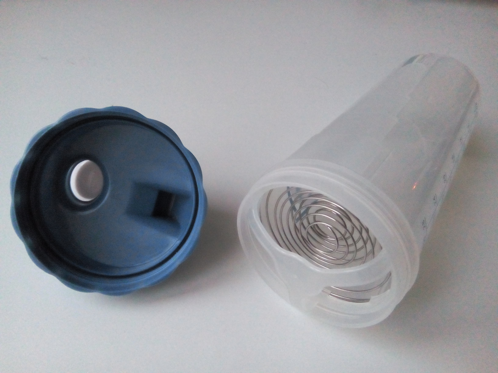

[Soylent](https://en.wikipedia.org/wiki/Soylent_%28food%29) is something I've wanted to try for a while, but I only got around to it recently (mostly because I don't live with my parents anymore).

Basically, it's a powder you blend with water. And BAM, here is your meal.

Unfortunately, Soylent is not available in Europe. However, there are plenty of alternatives!
In this series of blog posts, I will try as many as possible - well, not the shady or expensive ones. At the time I write this, I have already tried 3 brands.

[Queal](https://queal.com/) is the first brand I tested, because they are, though not leader, [well established on the market](https://www.instant.ly/report/5762d6e6e4b077dda75559cb#570150e1e4b01f436648be68) and to me they seemed more serious and concerned about the quality of their product than some of their competitors.

## Shipping

From the Netherlands to France: 5 days! Pretty good if you ask me.

## The meal

I chose the [Taste taster](https://order.queal.com/order/). It contains a bit of every taste.
Sadly the minimum amount of Queal you can buy is worth 49€, I don't know if it costs them too much to send small quantities, but I'm sure many potential customers are driven off because of this.

The taste is not bad. It's not good either. It tastes a bit like wheat.
For lunch or dinner, it's acceptable, for breakfast it's actually pretty good. I especially like the "Cool Chocolate" taste.

After drinking it for the first time, I felt full, but I still wanted to chew. It's weird to have something completely liquid as a meal. Once you get used to it, you start to fell less the need to chew, but I recommend a chewing-gum after your meal until you get accustomed.

My gut bacteria had to adjust. I had more gas than usual for a few day, then it got better.

Nowadays I mostly take it the morning. I have been able to reduce the time my breakfast takes from 10 minutes to 3 minutes. I'm very much not a morning person so being able to spend 7 more minutes each day in my bed is quite nice.
I also sometimes take it when I know I won't have enough time for lunch. It's less expensive than buying a sandwich, healthier and it takes less time!

## The portions

At first I had trouble figuring out how much to eat. Queal comes in tiny bags, each of which contain 3 meals (for an average person).
It is not easy to figure out what are the proportion of water and powder, and the website doesn't provide much information.
I found an old YouTube video though, where they said it was about 3.5 spoons.
After after some trial and error, I found that 4 spoons suit me better.

## The shaker

The shaker is pretty good. It has a spiraling wire near the opening, that blends the powder with the water when you shake it. I have seen previous iterations of the shaker where the whisk was a little ball, independent from the shaker. ~~It must have been much less handy.~~ 02/02/2017 edit: I since then had the opportunity to try one such shaker, it's actually not bad. Stay tuned, I'll talk about it in a future review!

There is a little problem though, in some configurations, some of the powder gets stuck in a hollow in the cap. It happens when the blades of the shaker are right in front of the hole. So just slide it so it isn't.

