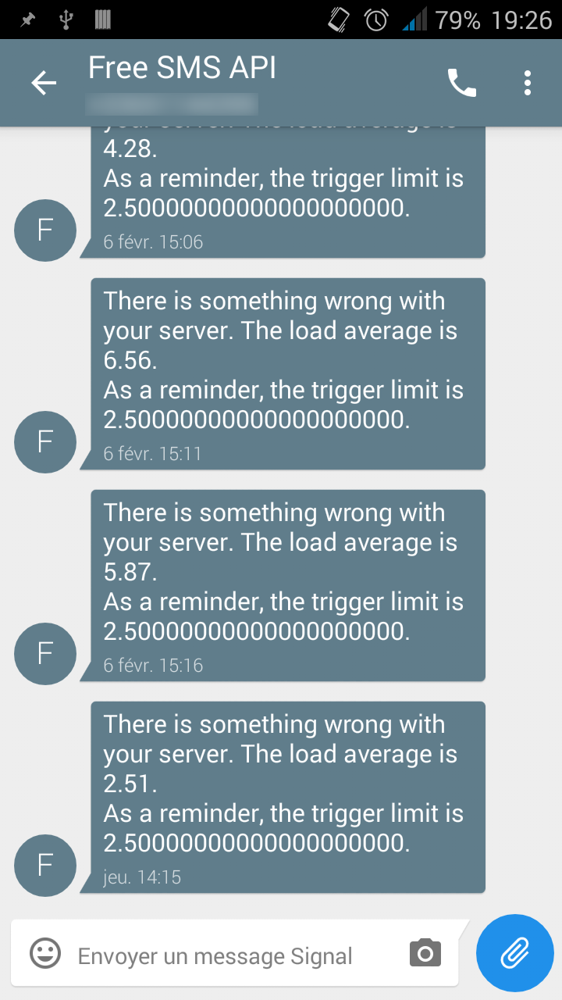

My mobile carrier offers access to an [API that can send SMS](https://mobile.free.fr/moncompte/) to its users. With systemd's timers, I have been able to make a script that warns me when the load on my server is too high!
Basically, timers work by stating a service repeatedly; which in turn starts a script in this case.
This shell script is responsible for checking the load and sending a SMS. Of course, you can have it send you a mail too. Or tweet it, or whatever - sky's the limit.

## The script
This shell script is in charge of checking the load average and sending a SMS if it's too high.

It is easy to get the load average of the last 5 minutes with the command `cat /proc/loadavg | awk '{print $2}'`, but we must adjust the trigger depending on the amount on cores on the computer. To do so, `nproc` works fine, or more portable: `grep processor /proc/cpuinfo -c` (checks the amount of occurrence of the word "processor" in `/proc/cpuinfo` and thus the amount of cores).

Eventually we compare the load and the trigger limit. There's a pitfall though: the shell (`bash` and `sh` as far as I know, I've heard it's different for zsh) does not work on floating point number, so we need to pipe this computation to `bc`.

Here's the script I come up with:
```sh
#!/bin/sh
limit=125 # Percentage of total load

core_nbr=$(grep processor /proc/cpuinfo -c) # Amount of core. Equivalent to $(nproc) but more portable
trigger=$(echo "($limit / 100) * $core_nbr" | bc -l) # trigger limit, which depends of how many cores you have
load=$(cat /proc/loadavg | awk '{print $1}') # Load average of the last minute

if [ $(echo "$load > $trigger" | bc) = "1" ]; then
	echo "The load average is very great, I should send you an e-mail"
	message="There is something wrong with your server. The load average is $load.%0D%0AAs a reminder, the trigger limit is $trigger." # %0D%0A is a line break

	curl "https://smsapi.free-mobile.fr/sendmsg?user=secret&pass=secret&msg=$message"
fi
```

## Timer

`/etc/systemd/system/` is the directory where every manually added systemd file should go, so this is where you can create a service file called for example `getkey-sms-watchdog.service`.
```systemd
[Unit]
Description=Send a SMS if the load average is TOO DAMN HIGH

[Service]
ExecStart=/home/getkey/monitor_load_average.sh

[Install]
# It's of no use making HTTP requests when there's no Internet access
Requires=network-online.target
After=network-online.target
```

Now, the timer. It must have the same filename as the service file, except of course the extension which must be ".timer". So, let's create `getkey-sms-watchdog.timer`:
```systemd
[Unit]
Description=Send a SMS if the load average is TOO DAMN HIGH

[Timer]
OnBootSec=10min # Start first 10 minutes after boot
OnUnitActiveSec=5min # Then restart every 5 minutes

[Install]
WantedBy=timers.target
```

You can enable all of this by running:
```console
sudo systemctl enable getkey-sms-watchdog.timer # Start on boot
sudo systemctl start getkey-sms-watchdog.timer # Enable it for this session, too
```

It is possible to check that the timer is working properly by running `systemctl list-timers`.


And here is a pic of the result!

