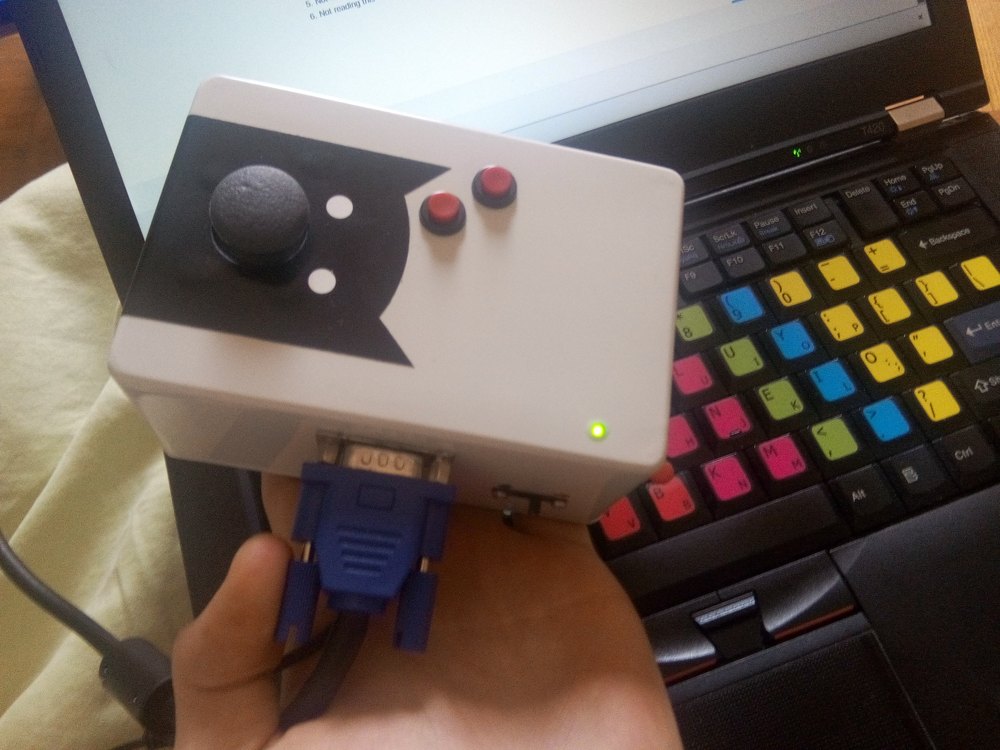
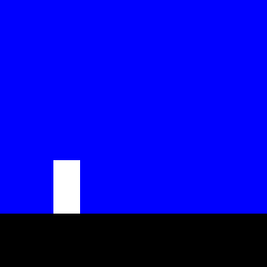
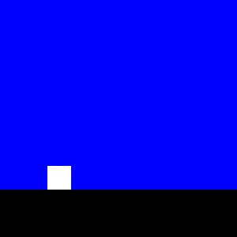

A while ago, I received an odd little piece of hardware in the mail.



It was a birthday present from my friend [Florian](https://github.com/Fju/), the [NanoStation](https://github.com/Fju/NanoStation). Along with it was a letter. Florian challenged me to make a game for it.

I knew that the hardware was very limited and I wanted to see how much I could push it. So, I decided to make a platformer -- ...okay, the truth is, it was actually because I love platformers!
I brainstormed some ideas with [another friend](https://github.com/Inspirateur). Then I started working on the game.
Unfortunately, it was around the time I moved to the Netherlands, and I did not finish it. But this summer, I went back to it and finished the damn thing!

<iframe type="text/html" width="640" height="360" src="https://www.youtube.com/embed/51G9NCDZTCM?autoplay=0&origin=https://getkey.eu"></iframe>

## No debugger

When I first started working on it, I wanted to adapt a [swept AABB algorithm](https://blog.hamaluik.ca/posts/swept-aabb-collision-using-minkowski-difference/). I got stuck because I was unable to debug it properly: the only thing I could do was displaying numbers directly on the screen.

The problem of displaying value on the screen is that, well, previous values get cleared each frame. In order to recreate some kind of useful history of the values, I used the ghettoest method: I filmed my screen. Then, using a video editing software, I replayed my screen frame by frame. It was a bit tedious but hey, it worked!

By the way, I later found out that I noobily overlooked [`Serial`](https://www.arduino.cc/reference/en/language/functions/communication/serial/). But it was too late at this point. Serial needs ~100 bytes of memory, which I could no longer afford as my program had grown bigger.

## Raycasting

Instead of doing AABB collision, I had a new idea. First, I would simplify the character.

From this:



The character became this:



It's not much of a difference visually, and changes nothing to the gameplay, but it makes programming _much easier_.

Now the collision detection can be implemented as a single raycast. I send a ray that goes, pixel by pixel, from where the character currently is, towards the place where it needs to reach. If there is a pixel which is part of a platform on the way, the player is stopped right there.

<object type="image/svg+xml" data="brensenham_raycasting.svg"></object>

It's reasonably easy to implement using [Bresenham's line algorithm](https://en.wikipedia.org/wiki/Bresenham%27s_line_algorithm), and very cheap. I calculated that in my game, such a raycast would never do more than 6 iterations.

I improved a bit upon the original algorithm though. I added _sliding_ to it. This allows me to apply gravity to the velocity vector.


<object type="image/svg+xml" data="brensenham_raycasting_slidding.svg"></object>

I hope this animation is explanatory enough. I would have liked to go into more details on how I did that, but 6 months have passed since I wrote this code, and I can't anymore. [This piece of code](https://github.com/getkey/NanoStation/blob/01e2a71fc347b52e812ba32dc417568e35dd2386/src/up2/character.cpp#L7) is disgusting, buggy, uncommented and honestly, I don't want to see it ever again. I'm not even sure if I knew what I was doing when I wrote it. If you're about to click the link... You've been warned.

## Memory use

The NanoStation is built with an Arduino Nano, which itself is powered by an [ATmega328](https://en.wikipedia.org/wiki/ATmega328) with the following characteristics:

- 2 kB RAM
- 32 kB PROGMEM
- 16 MHz

While 2 kB seems actually decent at first glance, it definitely was my main limitation coding this game.
The NanoStation is built with a 120x60 pixel wide screen. Each pixel can be one of 4 different colors. Given that 4 colors can be stored on 2 bits, each byte can store 4 pixels.
If we do the math: `(120 * 60) / 4 = 1800`. The library that handles the screen already needs 1800 bytes!
I'm left with only 248 bytes. Actually, I'm left with even less because it uses a little bit more than just that.

Hopefully there is [PROGMEM](https://www.arduino.cc/reference/en/language/variables/utilities/progmem/). PROGMEM is the flash memory space where the program itself is stored. Arduino has a neat keyword that allows putting any arbitrary data in there.

Game maps use up a lot of memory, and you only ever need one at once, so I decided to put them in PROGMEM and load them as needed. Maps are represented by an array of `Platform` instances.
At first I tried to put these platform arrays in PROGMEM, but they consistently ended up in regular memory without any warning on the part of the compiler. I pulled my hair out for quite a bit. Then I realized that PROGMEM is for storing compile time constants. If an object needs to be instantiated, it can't be stored in PROGMEM!

The [types that you can put in PROGMEM](http://www.nongnu.org/avr-libc/user-manual/group__avr__pgmspace.html#typedef-members) are fairly basic. I opted to define my maps as a bunch of bytes like so:

```c
const PROGMEM byte fju[]  = {
	4, // map size (in number of platforms)
	10, 50, 20, 10, 1, 224, // platform (x, y, width, height, blink frequency, blink offset)
	30, 45, 30, 5,  1, 224, // platform (x, y, width, height, blink frequency, blink offset)
	65, 43, 20, 10, 1, 224, // platform (x, y, width, height, blink frequency, blink offset
	80, 55, 40, 5,  2, 160, // platform (x, y, width, height, blink frequency, blink offset
};
```

When loading a level, I use a routine that reads them from PROGMEM and parse them into an array of platforms.

## Display issues

As you may have guessed, I couldn't implement [double buffering](https://en.wikipedia.org/wiki/Multiple_buffering) because of how little memory I had at my disposal.
I nevertheless attempted the classic approach of clearing the display each frame and redrawing everything. Of course, I expected to have some artifacts because that's just what you get when you can't double-buffer. It happened indeed, and on top of it, the FPS became slow as molasses. You could very distinctly see rectangles getting drawn.

So I had to resort to something else: never clearing the screen, and redrawing only what changed. If the player moved I erased its previous position by painting it with the color of the sky, and if a platform turned yellow, I would only paint _this_ platform. You get the point.

That proved to work well, and with that done, the game has neither poor FPS nor artifacts. Hopefully, given how simple the game is, it was pretty trivial to implement.

---

Thanks for the great gift Fju, and one eternity later, here is the game! Enjoy!

PS: in case you're wondering, the name of the game is Up2 because I was Up2 the challenge. It just uh... took me a while.
