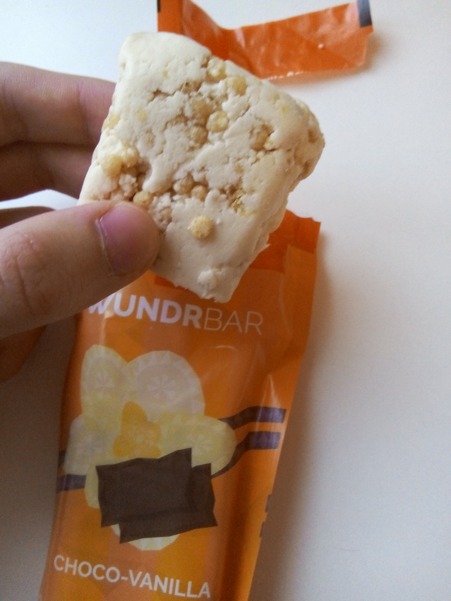
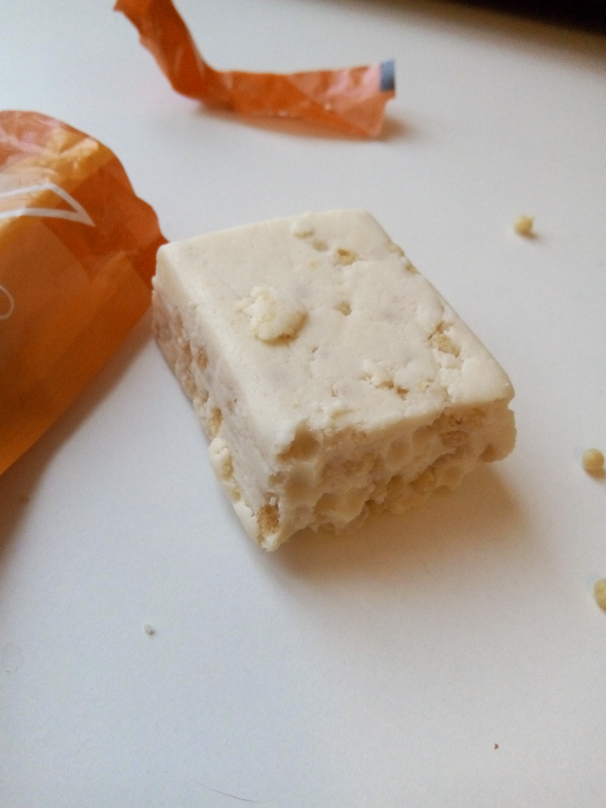
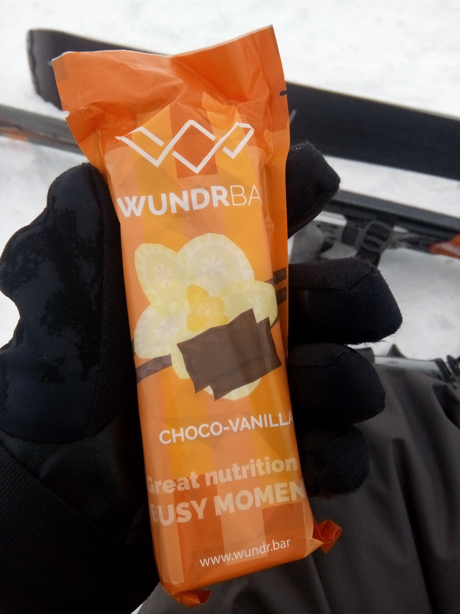
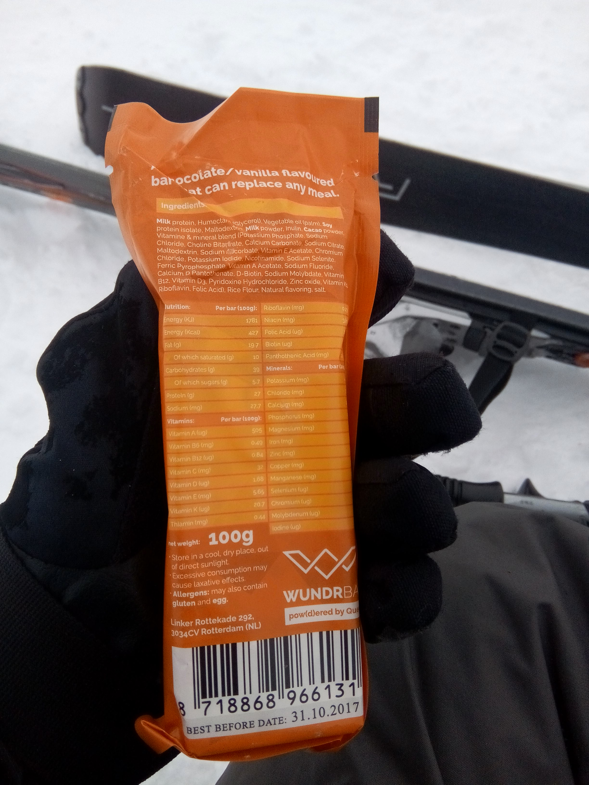

[WundrBars](https://order.queal.com/bar/) were created to provide the same things as their powder counterpart, in a more convenient format.

Before you read this article, you should know that Queal contacted me to ask me if I wanted to review the WundrBars. Because I'm interested in trying out soylent-likes, I gladly accepted, and they sent me some (thanks Laurens!). I'll try not to be biased though.

## Shipping and packaging

Less than a week. Very fast!

I think the wrapping paper looks cheap (see the pictures), but what really matters is inside, eh?

## Taste and texture

I only tried the "choco-vanilla" version but there is also another flavor available: "choco-hazelnut".

The texture is akin to nougat. The taste is not that far either, probably due to the vanilla. However it tastes nothing like chocolate.
It is quite sweet but looking at the [nutritional informations](https://order.queal.com/bar/) it seems that this is only an impression.
There are some little puffed grains that add crisp to the texture. It is in my opinion a very good idea.

The surprising thing is that if you eat too much of it at once (I'd say more than a half), you start to notice a slightly salty aftertaste. It's still eatable but not as enjoyable. So I recommend taking time when eating, or not to eat the whole bar at once. I actually like to have it on my desk while I work, so that I can take a few bites there and there.

It doesn't feel dry, but made me thirsty nevertheless. I make sure to have a water bottle around when eating.

## Nutritional aspect

The bars are not as nutritious as the powder: 400kCal versus 700kCal for a powdered meal. But I have been surprised how much energy is packed in these tiny bars. I skied intensely for 3 hours without being hungry, having only eaten one bar for breakfast.

## Bar vs. powder

The bar format is certainly more convenient than the powder. I ate a WundrBar while walking towards my university without any problems. That wouldn't have been the case with a powder meal -- trust me, I tried too.

It is also something you can carry around easily, whereas the powder needs to be carried with a shaker.

The price is higher than powder meal. It's 2.5€ a bar, however a bar is not a full meal.
If you only ate that in a day you'd need 5 bars, which costs 12.5€, versus 7€ for a day worth of Queal powder.

I don't think it would have replaced powder meals for me but when in a rush I'd probably have grabbed a bar if it costed less. Unfortunately I'm a student with limited financial resources so I'll do without!
